# Company Profile Website - Laravel MVC Implementation

## 1. Project Title
**Enterprise Company Profile Website**

---

## 2. Introduction

### What is a Company Profile Website?
A Company Profile Website serves as an official digital storefront and informational hub for a business. It presents essential details about the company, such as its mission, services, products, team, and contact information, to prospective clients, investors, and job seekers.

### Why Businesses Need One
* **Credibility & Trust:** Establishing an official online presence builds customer confidence.
* **Brand Awareness:** Reaches a global audience 24/7 without geographical limitations.
* **Lead Generation:** Provides accessible contact points and inquiry forms for prospective clients.
* **Cost-Effective Marketing:** Acts as an interactive, easily updated platform compared to traditional print media.

### Purpose of the Project
The primary purpose of this project is to build a multi-page dynamic company profile web application using PHP and Laravel’s Model-View-Controller (MVC) architecture. It demonstrates key concepts such as routing, controller-based request handling, reusable Blade layouts, and clean project organization.

---

## 3. Objectives
* Successfully configure Laravel Routing in `routes/web.php` for static and dynamic pages.
* Implement `CompanyController.php` to handle web request logic and pass data to views.
* Utilize the Blade Templating Engine to establish dynamic, reusable layouts (`@extends`, `@section`, `@yield`, `@include`).
* Structure a clean, responsive navigation bar and footer component.
* Create a public GitHub repository with a structured Git commit history (minimum of 8 commits).
* Document the project architecture and publish a professional portfolio post.

---

## 4. MVC Architecture

### What is MVC?
MVC stands for **Model-View-Controller**, a architectural software pattern that separates an application into three interconnected components:
* **Model:** Handles data logic, business rules, and database communication.
* **View:** Manages the user interface (UI) and visual representation of data.
* **Controller:** Acts as an intermediary, receiving input from the user (via routes), processing business logic, interacting with the model, and selecting a view to render.

### Why Laravel Uses MVC
Laravel uses MVC to enforce **Separation of Concerns**. By isolating data management, application logic, and presentation design, Laravel keeps code organized, scalable, and easy to maintain.

### Advantages of MVC in Software Development
1. **Parallel Development:** Front-end developers can design Views while back-end developers build Models and Controllers.
2. **Maintainability:** Modifying the UI or visual layout does not disrupt core business logic.
3. **Reusability:** Views and layout components can be reused across multiple pages.
4. **Testability:** Controllers and Models can be tested independently of the user interface.

### Mellovia Creamery Request Flow
Browser (User enters URL / clicks nav link)
   │
   ▼
Route (routes/web.php maps request to CompanyController)
   │
   ▼
Controller (CompanyController.php handles logic & views)
   │
   ▼
Blade View (resources/views/pages/ with layout components)
   │
   ▼
Response to Browser (Renders Mellovia Creamery UI)

## 5. Laravel Routing

Key Routing Concepts
Route Definitions: This is the official declaration of URL endpoints inside routes/web.php. It specifies the HTTP method (such as GET, POST), the path, and the corresponding logic or controller function.

GET Requests: The HTTP GET method is used to request or retrieve data from the server without modifying any data in the database. All standard navigation across pages (Home, About, Services, Contact) utilizes GET requests.

Named Routes: Assigning a unique name to a route using the ->name('route.name') helper. This provides flexibility because if the actual URL path changes in the future, you won't need to manually update every hyperlink across the entire application.

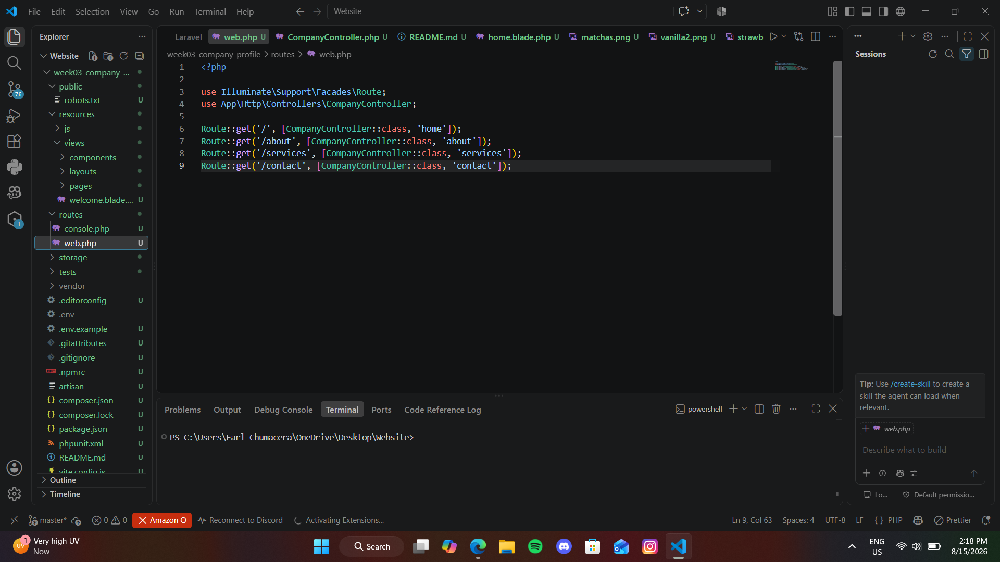

## 6. Controllers
Purpose of Controllers
The Controller serves as the "brain" or intermediary between the Model and the View in the MVC architecture. Instead of placing all business and rendering logic directly inside routes/web.php, it is separated into dedicated Controller classes to keep the application clean and organized.

Benefits of Controllers
Organization: Groups related HTTP request handlers together in a single file.

Reusability: Methods defined inside a controller can easily be invoked or reused.

Middleware Integration: Makes it easier to apply authentication, validation, and security filters across the whole class or specific functions.

Cleaner Code: Prevents bloated routing files by offloading execution logic.

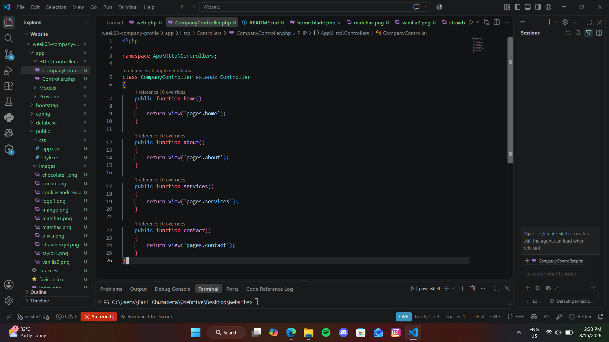

## 7. Blade Templating Engine
Blade is the powerful yet lightweight templating engine included with Laravel. It allows the use of plain PHP code within views while providing a clean, concise, and fast syntax for constructing dynamic UI layouts.

Core Blade Directives & Components
Blade Layouts: A master template containing the general HTML structure (head tags, external CSS/JS scripts) and repeating components like the Header and Footer.

Blade Components: Reusable small UI parts (such as the Navigation Bar or Footer) included within the master layout or other views.

@extends('layout.app'): Placed at the top of a child view to inform Laravel that it will use the designated Master Layout file.

@yield('content'): Used in the Master Layout to reserve space where content from the child view will be fetched or rendered.

@section('content') ... @endsection: Used in the child view to specify the exact content that will be injected into its corresponding @yield in the master layout.

@include('components.navbar'): Directly imports a separate Blade template component inside the current layout file.

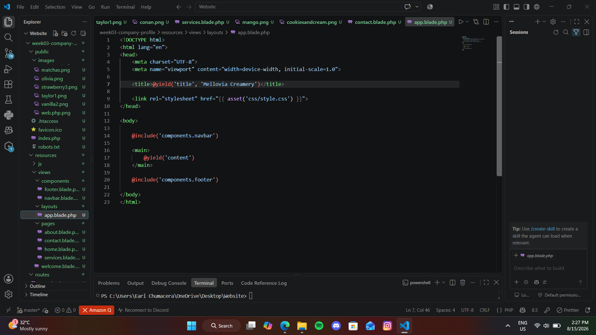

## 8. Laravel Folder Structure
Laravel is structured with a neat and predictable folder hierarchy to ensure a high level of code organization:

app/
Contains the core code of the application. This is where Controllers (app/Http/Controllers), Models, Middleware, and Providers reside.

routes/
Stores all route definitions for the application. The web.php file handles web-based interface requests.

resources/
Contains uncompiled front-end assets and views. This includes Blade Templates (resources/views), Raw CSS, and JavaScript files.

public/
The web root directory where all incoming HTTP requests enter (index.php). It also stores public assets such as images, compiled CSS, and JS files.

bootstrap/
Contains files that optimize and bootstrap the Laravel framework setup, including app.php and configuration cache files.

config/
Houses all official configuration files for the entire framework (such as database.php, app.php, mail.php).

## 9. ScreenShots

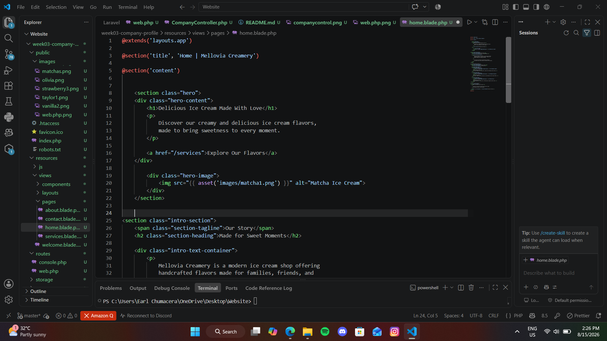
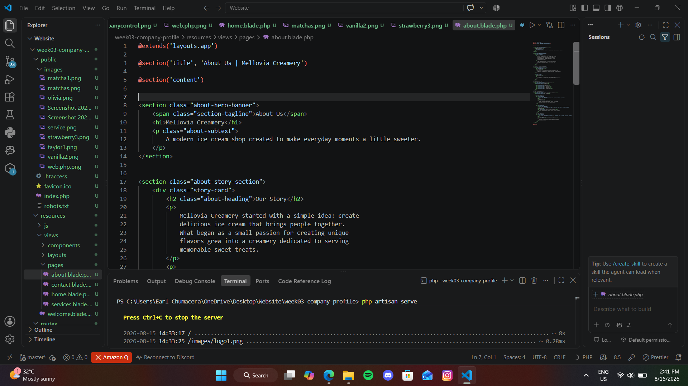
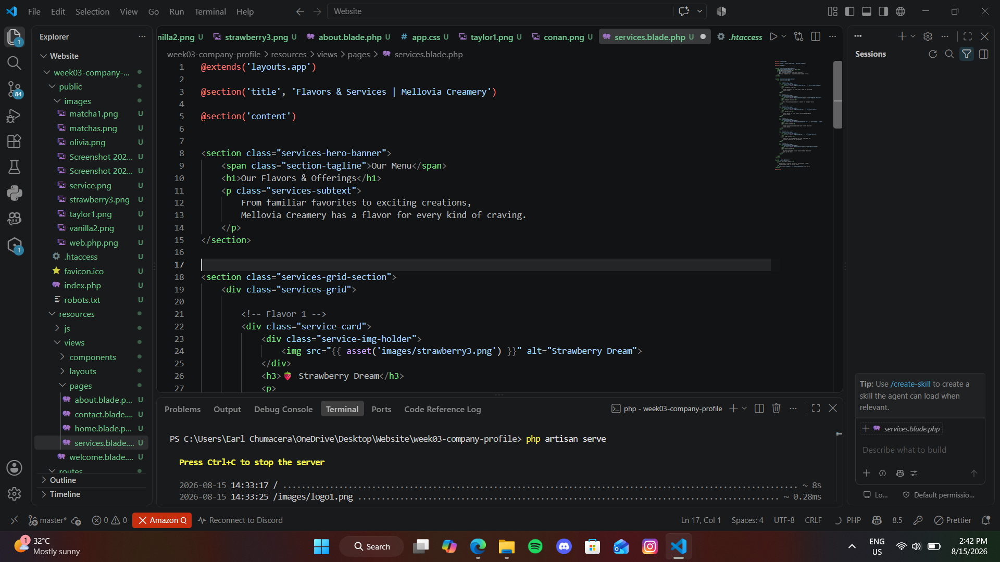
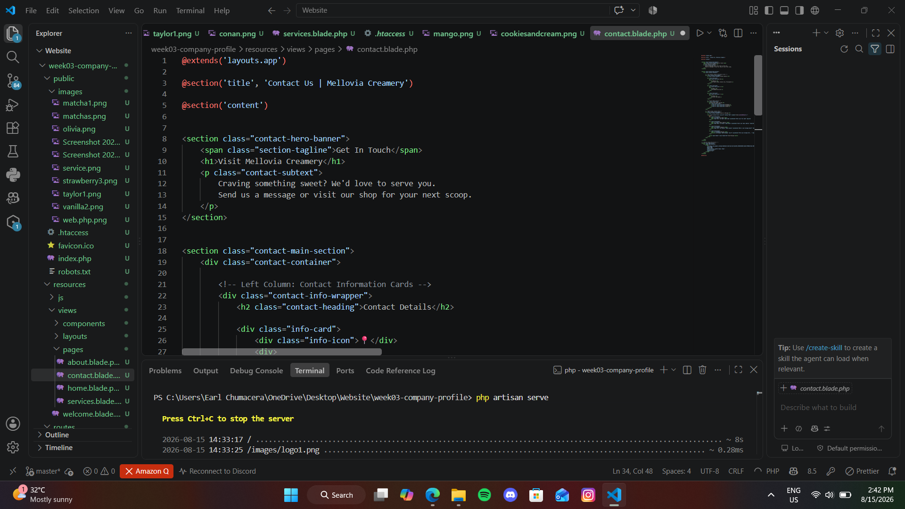
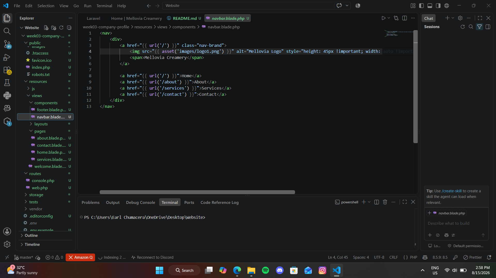
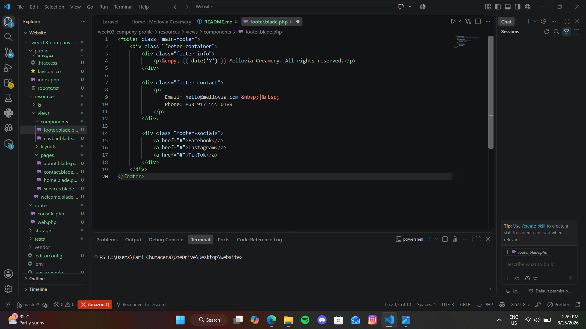

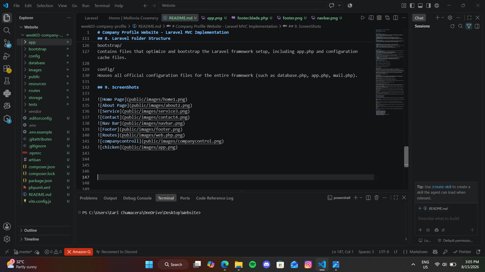

## 10. Problems Encountered
While developing the Laravel MVC Company Profile application, the following technical challenges were encountered:

Target Class / Controller Namespace Issue (Target class [CompanyController] does not exist):

Upon defining initial routes in routes/web.php, a runtime error occurred because Laravel could not locate CompanyController.

View Not Found Error (InvalidArgumentException: View [pages.home] not found):

Encountered this error when attempting to render the home page after adding a Controller method.

Blade Syntax and Inheritance Misconfiguration Errors:

Issues arose where content from child views (home.blade.php) failed to render in the browser or resulted in broken HTML layout structure.

## 11. Solutions
The steps taken to resolve the aforementioned issues:

Resolving Controller Namespace Issue:

Added the proper use import statement at the top of the routes/web.php file: use App\Http\Controllers\CompanyController;. Also verified that the namespace inside app/Http/Controllers/CompanyController.php was explicitly set to namespace App\Http\Controllers;.

Resolving View Not Found Error:

Inspected file naming and directory hierarchy inside resources/views/. Identified a typo or misplaced Blade file outside the pages subfolder. Corrected the path structure to resources/views/pages/home.blade.php to match the view('pages.home') call from the Controller.

Resolving Blade Inheritance and Layout Issues:

Ensured that the layout name in @extends('layouts.app') matched resources/views/layouts/app.blade.php exactly. Aligned @yield('content') in the Master Layout with @section('content') in each Child View, making sure sections were closed properly using @endsection.

## 12. Reflection
Building my first multi-page web application using Laravel's Model-View-Controller (MVC) architecture provided me with a strong foundational understanding of modern server-side software development. Prior to working with Laravel, managing dynamic content often meant mixing HTML structural markup, style parameters, and PHP execution logic within single, cluttered files. This project clearly demonstrated the transformative power of architectural patterns in organizing code, improving scalability, and enforcing structural cleanliness across a web application.

Understanding the core philosophy of MVC—specifically the Separation of Concerns—was one of the most rewarding takeaways from this assignment. Separation of concerns dictates that distinct features and responsibilities within a program should be divided into isolated sections. In Laravel, the Model manages business data rules, the View handles the user interface presentation, and the Controller acts as the intelligent mediator. This separation ensures that changing the visual aesthetics of a webpage in a Blade template requires zero modifications to underlying routing or request-handling logic. For developers, this isolates bugs, prevents unintended side effects during updates, and dramatically increases overall code maintainability.

The seamless interplay between routes, controllers, and views forms the core request-response lifecycle of Laravel applications. When a user requests a URL, Laravel's router interprets the incoming HTTP request and delegates execution to a specific method within CompanyController. The controller evaluates any required logic and determines which Blade view should be returned. The Blade Templating Engine then dynamically assembles layout components—such as headers, footers, and content sections—into a clean HTML payload delivered straight back to the user's browser. Experiencing this entire flow firsthand demystified how client-server web technologies operate under the hood.

Looking ahead, the architectural principles mastered in this project extend far beyond simple company profile websites. In large-scale enterprise environments, applications manage thousands of concurrent users, complex database transactions, third-party API integrations, and robust authorization pipelines. Utilizing a structured MVC framework ensures that massive development teams can collaborate simultaneously without code conflicts—frontend designers can polish Blade views while backend engineers optimize Controllers, Services, and Database Models. Mastering these foundational concepts serves as a critical stepping stone toward developing secure, modular, and enterprise-grade software systems.

## 13. References
Laravel Documentation. (n.d.). Routing & Controllers - Laravel 11.x. Laravel. https://laravel.com/docs/11.x/routing

Laravel Documentation. (n.d.). Blade Templates - Laravel 11.x. Laravel. https://laravel.com/docs/11.x/blade

MDN Web Docs. (2023). Model-View-Controller (MVC) architecture definition. Mozilla Developer Network. https://developer.mozilla.org/en-US/docs/Glossary/MVC

PHP Documentation. (2024). PHP Manual: Classes and Objects. PHP Group. https://www.php.net/manual/en/language.oop5.php

Tailwind CSS Documentation. (2024). Utility-first CSS framework for rapid UI development. Tailwind Labs. https://tailwindcss.com/docs

## Diagram

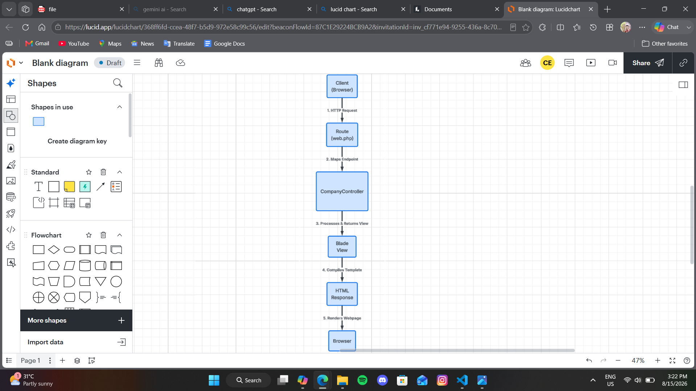

